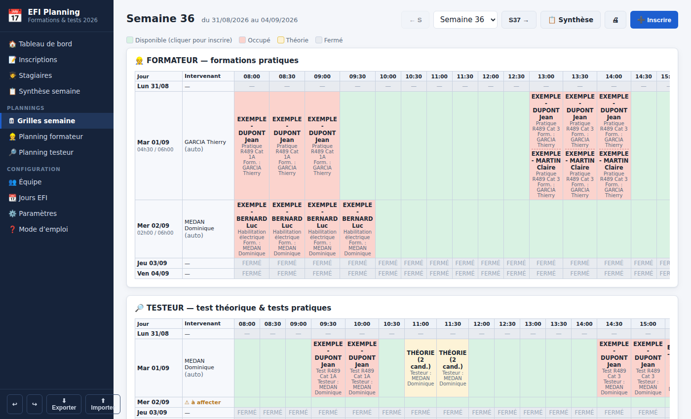
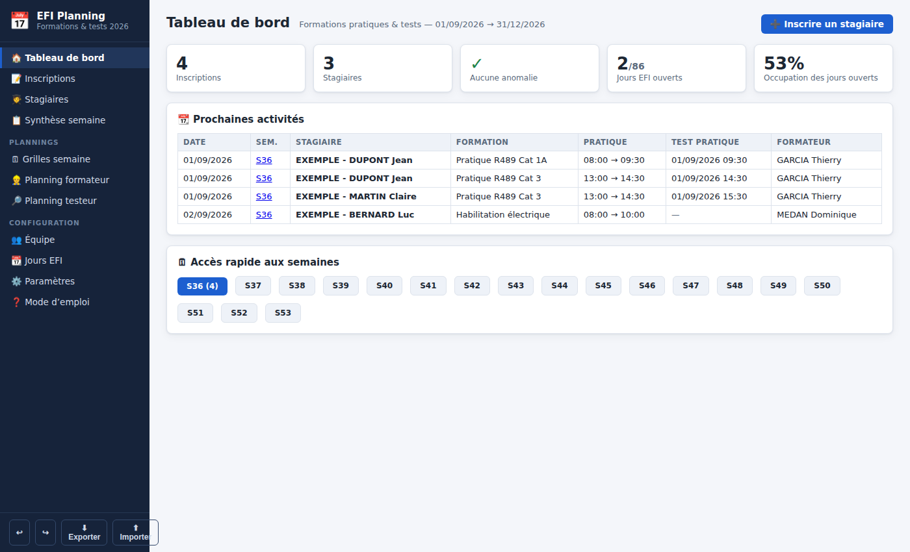
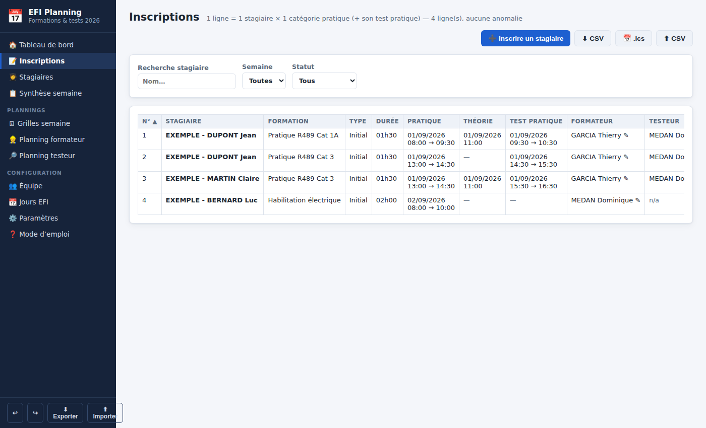
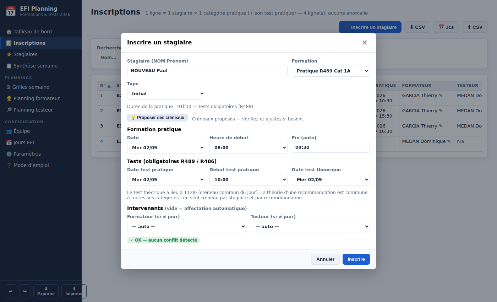
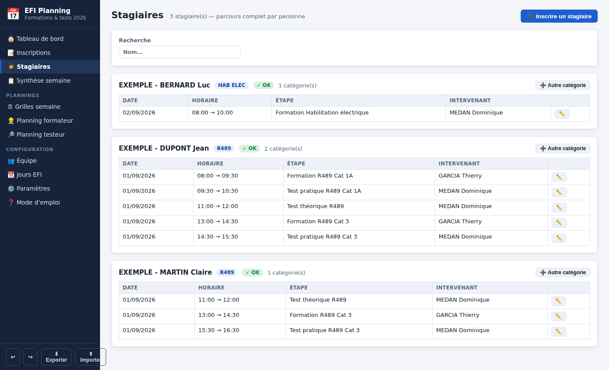
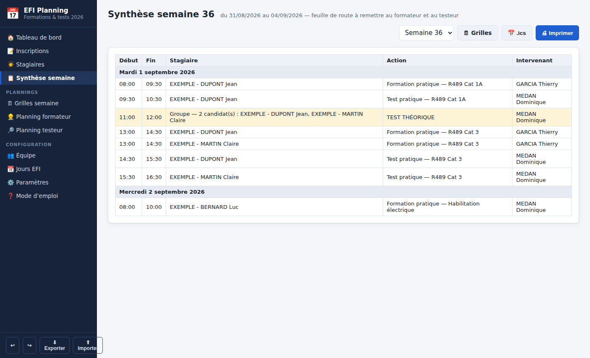
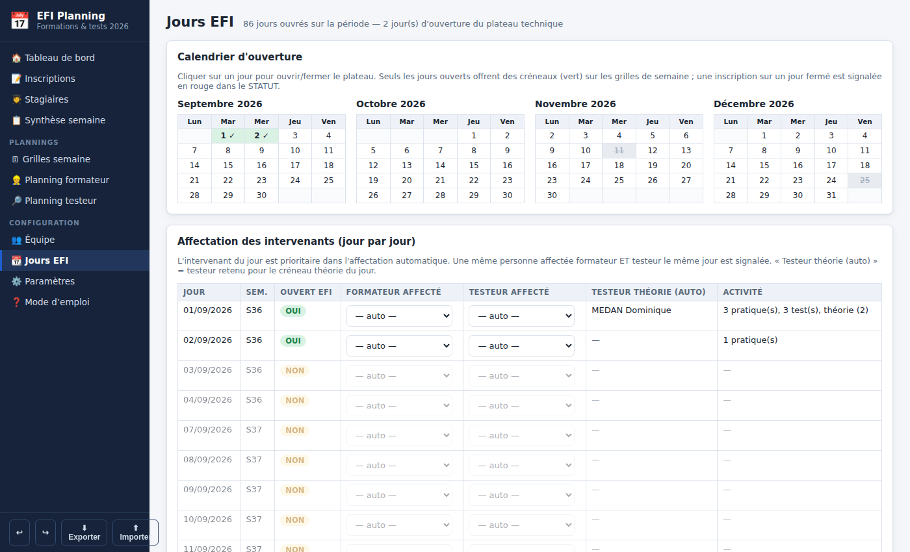

# EFI — Planification des formations pratiques & tests

Application web de gestion des réservations du plateau technique EFI :
formations pratiques et tests CACES (R489, R486) et Habilitation électrique,
sur la période du **01/09/2026 au 31/12/2026** (86 jours ouvrés, période
modifiable).

Transposition fidèle du classeur Excel « Planification EFI v4.2 » :
même principe (1 ligne = 1 stagiaire × 1 catégorie), mêmes contrôles
automatiques, mêmes vues (grilles semaine, synthèse imprimable, plannings
formateur/testeur), avec en plus le confort d'une vraie application.



## Lancer l'application

Aucune installation, aucune dépendance. Il suffit d'un serveur statique :

```bash
cd efi
python3 -m http.server 8080
# puis ouvrir http://localhost:8080
```

Les données sont sauvegardées automatiquement dans le navigateur
(localStorage) et peuvent être exportées/importées en JSON.

**Migration depuis le classeur Excel** : enregistrer l'onglet
« Inscriptions » au format CSV puis l'importer depuis la page
Inscriptions (bouton « ⬆ CSV ») — les en-têtes, formations et
intervenants sont reconnus automatiquement.

## Principe

- Deux ressources gérées en parallèle : le **FORMATEUR** (formations
  pratiques) et le **TESTEUR** (test théorique + tests pratiques).
- Plage 08h00 – 17h00, créneaux de 30 minutes.
- Tests obligatoires pour R489 / R486 : test pratique (1h) par catégorie,
  test théorique (1h) en créneau unique (11h00 par défaut), commun à toutes
  les catégories d'une même recommandation.
- Contrôles automatiques : capacité simultanée (2 chariots en R489 Cat 3),
  charge quotidienne ≤ 6h, chevauchements, formateur ≠ testeur du candidat,
  habilitations, jours d'ouverture EFI…
- Affectation automatique d'un intervenant habilité et libre (priorité à
  l'intervenant du jour), testing croisé possible.

## Guide de démarrage

1. **Équipe** : saisir les intervenants et cocher leurs habilitations
   (F = former, T = tester) par spécialité.
2. **Jours EFI** : cliquer sur le calendrier pour ouvrir les jours du
   plateau technique ; affecter éventuellement un formateur/testeur du jour.
3. **Inscrire** : depuis la page Inscriptions, un créneau vert d'une grille
   semaine, ou le bouton « ➕ » — le bouton « 💡 Proposer des créneaux »
   trouve automatiquement la première combinaison sans conflit.
4. **Vérifier** : la colonne STATUT signale toute anomalie en rouge
   (conflits d'intervenants, capacité, charge, jours fermés…).
5. **Distribuer** : imprimer la Synthèse semaine (feuille de route) ou
   exporter en `.ics` vers Outlook / Google Agenda.

| | |
|---|---|
|  |  |
|  |  |
|  |  |

## Tests

```bash
node --test tests/*.test.mjs
```

Les tests s'exécutent aussi en CI (GitHub Actions) à chaque push.

## Architecture

```
index.html          Point d'entrée (SPA sans build)
css/style.css       Styles
js/config.js        Paramètres par défaut (issus du classeur)
js/dates.js         Dates, semaines ISO, créneaux
js/store.js         État, persistance, import/export
js/engine.js        Moteur : affectation auto + contrôles (STATUT)
js/views/…          Vues (inscriptions, semaines, synthèse, plannings…)
tests/              Tests unitaires (node:test)
```

Voir [EVALUATION.md](EVALUATION.md) pour la grille d'évaluation et
l'historique des itérations.
